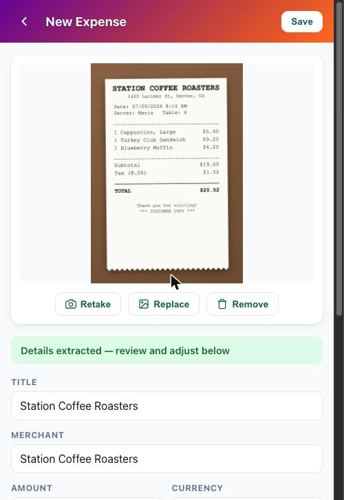
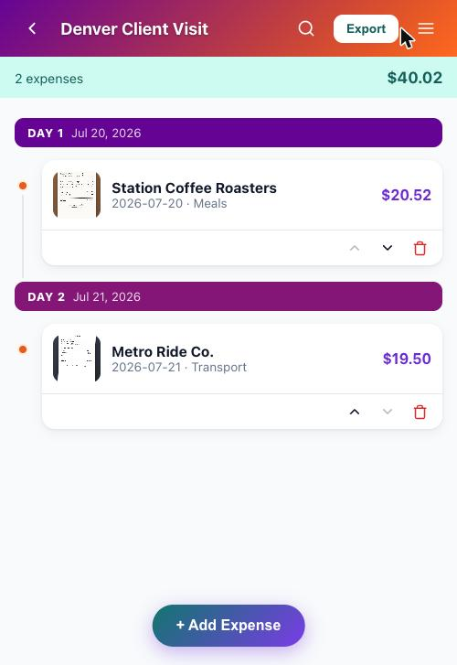
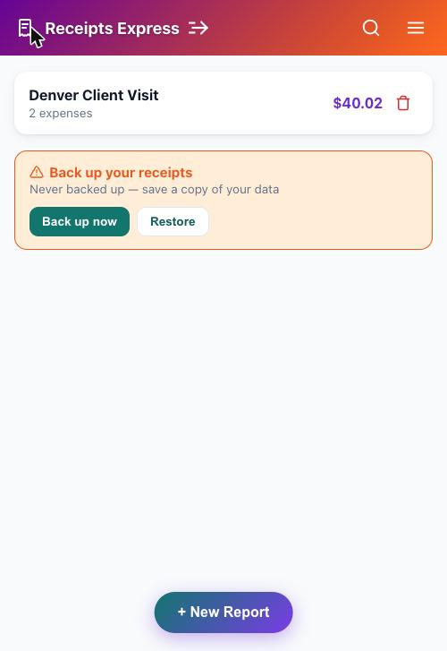

# Receipts Express Pilot Presentation

This markdown file represents the content of the interactive slide deck designed for co-workers who want to participate in the departmental pilot of **Receipts Express**. 

> [!TIP]
> You can also view the interactive, fully animated version of this slide deck directly in your browser by opening [docs/pilot-deck.html](./pilot-deck.html).

---

## Slide 1: Cover

### Receipts Express
**Standardized Receipt-to-PDF Capture**

* **Progressive Web App (Offline-First)**: Runs locally on any device.
* **Private by Design**: No servers, no accounts, zero data sharing.

---

## Slide 2: The Core Challenge

### The Challenge with Expense Capture
*Why traditional reporting causes friction and security risks*

#### 1. The Manual Burden
* Receipts accumulate loose in email inboxes, pockets, or camera rolls during business travel.
* Reconstructing dates, merchants, and totals weeks later leads to errors and delayed filing.
* No quick way to export polished compilations for downstream travel systems.

#### 2. The Privacy Trap
* Common free scanner apps contain third-party ad-tracking toolkits.
* Sensitive financial data (merchant locations, items purchased, card fractions) gets uploaded to unvetted cloud systems.
* Lack of structural boundaries leaves personal and corporate data vulnerable to exfiltration.

---

## Slide 3: The Solution

### Enter Receipts Express
*A fast, private utility running entirely on your device*

#### Key Pilot Features:
* **On-Device OCR**: [Tesseract.js](https://tesseract.projectnaptha.com/) scans receipts and extracts fields locally. No external APIs, no cloud processing.
    > **What is OCR?** OCR (Optical Character Recognition) is the automated technology that reads the text inside receipt images (merchant names, dates, and amounts) and converts it into editable digital text. Running it fully on-device via WebAssembly means no images or transcripts are ever sent over the network to external systems.
* **Reports Manager**: Create, name, and drag-and-drop receipts to reorder. Group expenses easily by business trip.
* **Secure Storage**: Data stays safely in your local browser sandbox ([IndexedDB](https://developer.mozilla.org/en-US/docs/Web/API/IndexedDB_API)). Zero servers are involved.
* **Local PDF Export**: Generates a comprehensive trip summary followed by full-page receipt images.

---

## Slide 4: Governance & AI-Efficiency

### Governance & Guidelines
*Inspiration and alignment with corporate frameworks*

Receipts Express's pilot governance structure is formatted after the **AI Pilot Program Template** from the FedEx AI Efficiency Hub. 

* **Inspiration Source**: [arigatoexpress/AI-Efficiency](https://github.com/arigatoexpress/AI-Efficiency) (FedEx AI Efficiency Hub). We credit their checklist for establishing the risk-review format we apply to this pilot proposal.
* **Why this matters**: Applying a standardized governance checklist upfront ensures privacy compliance, legal clarity, and clear risk mitigation strategies before introducing utility tools to departmental workflows.

#### Governance Checklist Snapshot:
| Field | Value / Response |
| --- | --- |
| **Data Classification** | Confidential (Receipts contain real personal/financial data) |
| **AI Engine Location** | On-Device Only (Self-hosted Tesseract.js WASM engine) |
| **Data Egress Control** | Enforced by Content-Security-Policy (`connect-src 'self'`) |
| **Human-in-the-Loop** | Active (User must verify and edit OCR drafts before saving) |

> **How Governance Applies to this Pilot:**
> * **Data Classification**: Receipts contain names, merchant locations, purchase itemizations, and partial card numbers. Since this is Confidential employee financial data, it is governed under strict corporate privacy requirements. Receipts Express complies by keeping all data local inside your browser profile's sandboxed storage.
> * **AI Engine Location**: Corporate policies restrict transmitting private data to unapproved cloud AI endpoints. Receipts Express mitigates this by self-hosting the Tesseract.js OCR engine locally. All text recognition runs on your device inside your browser sandbox, requiring no internet connection.
> * **Data Egress Control**: Policy compliance is enforced at the browser level via a Content-Security-Policy (CSP). The header `connect-src 'self'` programmatically blocks the browser from sending data to any external server or API, meaning even a compromised dependency cannot exfiltrate your receipts.
> * **Human-in-the-Loop**: AI algorithms can misread numbers or dates. To ensure financial audit readiness, the OCR engine only populates editable draft inputs. The user is the responsible human owner who must review and manually verify all dates and amounts before exporting the PDF.

---

## Slide 5: PWA Installation Guide

### Install on Your Device
*Install as a Progressive Web App (PWA) in seconds*

Running the web app as an installed PWA grants it **persistent storage protection**, signaling to the mobile OS to protect database files from automatic eviction.

#### iOS (Safari)
1. Open the app link in Safari.
2. Tap the **Share** button (box with up-arrow) in the browser toolbar.
3. Scroll down and select **Add to Home Screen** (plus icon).

#### Android (Chrome)
1. Open the app link in Chrome.
2. Tap the **Menu** icon `⠇` (three vertical dots).
3. Select **Install app** (download icon).

#### Desktop (Chrome / Edge / Safari)
1. Open the app link in Chrome or Edge.
2. Click the **Install icon** inside the right side of the address bar.
3. Alternatively, select **Install Receipts Express** from the browser's settings menu.

---

## Slide 6: Backup Architecture & Risks

### Backup Architecture & Risks
*Understanding browser storage lifecycle and durability*

#### Storage Eviction Risk
Since all receipts and images are stored locally in the browser database (IndexedDB) with no cloud backup, they are subject to **data loss** if:
* The device runs critically low on disk space.
* The user manually clears browser cache, cookies, and website data.
* The OS automatically purges browser caches to free up system space.

#### In-App Backup Dashboard
Receipts Express includes local backup controls to bundle all database records & base64 images into a single `.json` file:
* **The Stale Warning**: The app displays a warning card on the home screen if data goes unbacked-up for more than **7 days**.
* **One-Click Export**: Click **Back up now** to package the database and trigger the browser download/native share sheet.

---

## Slide 7: Backup Recommendations

### Backup Recommendations
*Best practices for pilot participants to safeguard data*

To ensure zero loss of receipt data while piloting the web application, participants must adhere to the following backup guidelines:

1. **Save JSON Backups — Local First, Then Cloud**: When clicking "Back up now", the app generates a single `.json` file containing all data. **Easiest:** save it straight to your device's local storage (Downloads or Files app) first — no login, no upload wait. **Then**, for redundancy, copy that same file into corporate/secured cloud storage under an `Expenses-Backup` folder, in this order: OneDrive, then Google Drive, then iCloud or SharePoint — whichever your organization provides.
2. **Backup Frequency Rule**: Always export a fresh backup after scanning new receipts on a trip. Do not ignore the in-app "Backup stale" warning. Treat Receipts Express as a **capture utility, not a long-term archive**. Export the final expense report PDF promptly.
3. **Cross-Device Restore**: If you upgrade your phone or switch browsers, export a backup JSON from your old device and click **Restore from file** on the new device to seamlessly merge all your reports, receipts, and images.

---

## Slide 8: Pilot Next Steps & Safety Guidelines

### Pilot Next Steps
*How to get started and contribute safely*

#### Safe Real-Trip Demo Guidelines:
* [ ] **Use the Live HTTPS Link**: Run the app via the production URL: [https://jwtc2000.github.io/Receipts-Express/](https://jwtc2000.github.io/Receipts-Express/) (also linked at the top of the repository). This live site enforces a browser-level Content-Security-Policy (CSP) that blocks all outgoing data.
* [ ] **What is "Dev Mode"?**: Regular pilot participants will not be using dev mode. "Dev mode" refers only to developers running raw source code on their personal laptops (using `npm run dev`) where browser blocks are bypassed to allow styling hot-reloads. The live website is completely secure.
* [ ] **Policy Compliance Window**: Since reports must be filed by the Wednesday following a trip, scan receipts as they happen, export the complete PDF/CSV on the final day of travel, upload it, and then clear the data from the PWA.
    > **How to clear it:** Open the Menu on the home screen and tap the trash icon on the report to delete it (and all its receipt images) — you'll be asked to confirm. To wipe everything in one step instead, use your browser's site settings → "Clear site data" for this origin.
    > **Why:** once a report is exported and safely backed up, there's no reason for corporate receipt images or OCR'd text to keep sitting on your device. Deleting it shortens the window during which that data could be exposed if the device is lost, shared, or compromised — keeping you inside the <10-day retention target.
* [ ] **Minimize Storage Duration**: Adhering to the Wednesday deadline ensures corporate financial data lives in the local browser database (IndexedDB) for less than 10 days, minimizing security exposure.
* [ ] **Daily Backups — Local First, Then Cloud**: Export a JSON backup daily during travel. Easiest option: save it straight to your device's local storage (Downloads or Files app) — no login, no upload wait. Then, for redundancy, copy that same file to corporate cloud storage the same day, in this order: OneDrive, then Google Drive, then iCloud or SharePoint — whichever your organization provides.
* [ ] **Verify and Report**: Cross-check OCR data values against the physical receipts and log formatting suggestions.

---

*Introduction to Receipts Express | Github: [Jwtc2000](https://github.com/Jwtc2000) (Bug reports: [Jwtc2000@users.noreply.github.com](mailto:Jwtc2000@users.noreply.github.com)) | Inspired by [AI-Efficiency](https://github.com/arigatoexpress/AI-Efficiency)*
